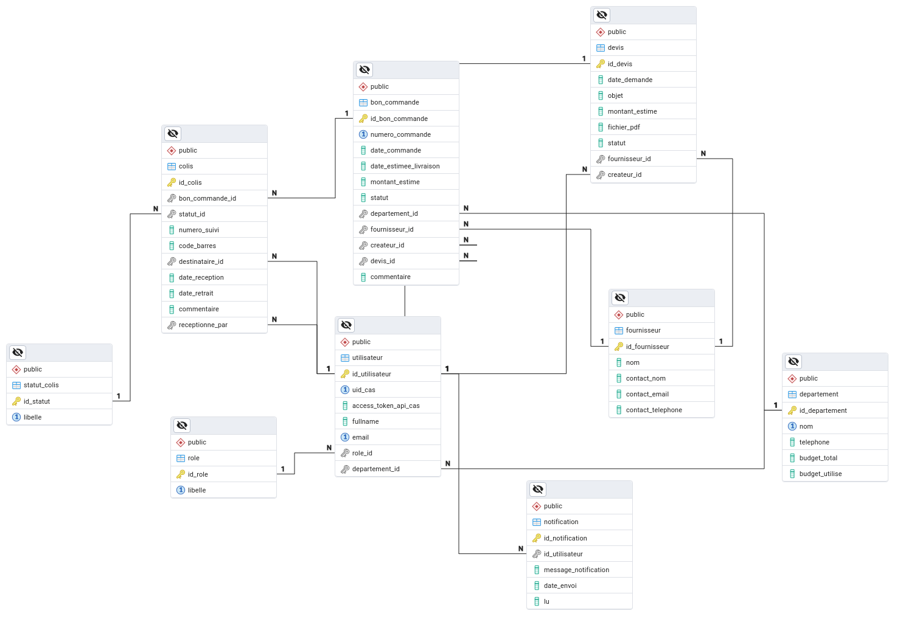

# SAE — Gestion des Colis

> Application web de gestion et de suivi des colis pour l'IUT.

<p align="center">
  
  
  
  
</p>



---

## Sommaire

- [Aperçu](#aperçu)
- [Démarrage rapide (Docker)](#démarrage-rapide-docker--recommandé)
- [Installation locale (sans Docker)](#installation-locale-sans-docker)
- [Accès aux services](#accès-aux-services)
- [Configuration (.env)](#configuration-env)
- [Commandes utiles](#commandes-utiles)
- [Dépannage](#dépannage)

---

## Aperçu

L'application repose sur **3 services** :

| Service | Rôle | Technologie |
|---------|------|-------------|
| **app** | Le site web (interface + logique métier) | PHP 8.3 + Apache |
| **db** | Base de données (schéma importé automatiquement) | MariaDB 11 |
| **pma** | Administration de la base via le navigateur | phpMyAdmin |

Deux façons de lancer le projet :

- **Docker** — tout est automatique (PHP, base de données, import du schéma). **C'est la méthode recommandée.**
- **Locale** — vous installez PHP et la base vous-même (utile pour développer sans Docker).

---

## Démarrage rapide (Docker) — *recommandé*

### Prérequis

- [Docker Desktop](https://www.docker.com/products/docker-desktop/) (Windows / macOS) ou Docker Engine + plugin Compose (Linux)

### Lancement en une commande

À la **racine du projet** :

```bash
docker compose up --build
```

C'est tout. La commande va :

1. construire l'image PHP 8.3 + Apache,
2. démarrer MariaDB et **importer automatiquement le schéma et les migrations**,
3. attendre que la base soit prête, puis démarrer le site.

Une fois les logs stabilisés, ouvrez **http://localhost:8000**

### Arrêter / relancer

```bash
# Arrêter (Ctrl+C dans le terminal, ou dans un autre terminal) :
docker compose down

# Relancer sans reconstruire :
docker compose up

# Repartir d'une base de données vierge (efface les données) :
docker compose down -v && docker compose up --build
```

---

## Installation locale (sans Docker)

À utiliser uniquement si vous ne souhaitez pas passer par Docker.

### Prérequis

- **PHP 8.3** minimum (avec les extensions `pdo_mysql`, `mbstring`, `xml`, `gd`, `zip`, `curl`)
- **Composer**
- Une base **MariaDB / MySQL** (Docker possible juste pour la base, voir étape 2)

### 1. Installer PHP et les extensions

**Linux (Ubuntu / Debian)**
```bash
make install-linux
```

**macOS**
```bash
make install-macos
```

**Windows**

Téléchargez PHP 8.3 : <https://www.php.net/downloads.php> — [tutoriel vidéo](https://www.youtube.com/watch?v=n04w2SzGr_U).
> Si PHP pose problème sous Windows, utilisez **WSL (Ubuntu)** puis suivez les instructions Linux.

### 2. Démarrer uniquement la base de données (via Docker)

```bash
cd DataBase && docker compose -f docker-bd.yaml up -d
```

### 3. Configurer l'environnement

```bash
make env
```

Puis adaptez `src/.env` à votre configuration (voir [Configuration](#configuration-env)).

### 4. Installer les dépendances Composer

```bash
make i
```

### 5. Lancer le serveur

```bash
make r
```

Le site démarre sur **http://localhost:8000**

---

## Accès aux services

| Service | URL / Accès | Identifiants par défaut |
|---------|-------------|--------------------------|
| **Site web** | <http://localhost:8000> | — |
| **phpMyAdmin** *(Docker)* | <http://localhost:8080> | `root` / `root_password` |
| **Base MariaDB** | `localhost:3306` | `root` / `root_password` |

**Se connecter à la base en ligne de commande (Docker) :**

```bash
docker exec -it sae_db mysql -u root -proot_password
```

---

## Configuration (.env)

Le fichier de configuration se trouve dans `src/.env` (copié depuis `src/.env.example`).

| Variable | Description | Valeur par défaut |
|----------|-------------|-------------------|
| `APP_ENV` | Environnement : `development` ou `production` | `development` |
| `APP_BASE_URL` | URL publique du site | `http://localhost:8000` |
| `DB_HOST` | Hôte de la base (`db` sous Docker, `127.0.0.1` en local) | `127.0.0.1` |
| `DB_PORT` | Port de la base | `3306` |
| `DB_NAME` | Nom de la base | `sae_colis` |
| `DB_USER` / `DB_PASSWORD` | Identifiants base de données | `root` / `root_password` |
| `CAS_HOST` | Serveur CAS (authentification université) | `cas.univ-paris13.fr` |
| `ADMIN_UIDS` | Identifiants administrateurs (séparés par des virgules) | `admin1,admin2` |

> Ne committez jamais votre vrai `src/.env` : seul `.env.example` doit être versionné.

---

## Commandes utiles

| Commande | Description |
|----------|-------------|
| `docker compose up --build` | Lance toute l'application (app + base + phpMyAdmin) |
| `docker compose down` | Arrête les conteneurs |
| `docker compose down -v` | Arrête **et réinitialise** la base de données |
| `make install-linux` | Installe PHP et les extensions (Ubuntu) |
| `make install-macos` | Installe PHP et les extensions (macOS) |
| `make env` | Copie `src/.env.example` vers `src/.env` |
| `make i` | Installe les dépendances Composer |
| `make r` | Lance le serveur PHP local |

---

## Dépannage

<details>
<summary><strong>Le port 8000 (ou 8080 / 3306) est déjà utilisé</strong></summary>

Un autre programme occupe le port. Soit vous l'arrêtez, soit vous changez le port dans `docker-compose.yml` :

```yaml
ports:
  - "8001:80"   # le site sera alors sur http://localhost:8001
```
Pour identifier le coupable : `lsof -i :8000` (macOS/Linux) ou `netstat -ano | findstr 8000` (Windows).
</details>

<details>
<summary><strong>La page affiche une erreur de connexion à la base au premier lancement</strong></summary>

La base met quelques secondes à démarrer. Le conteneur attend automatiquement, mais si l'erreur persiste : **patientez ~10 s puis rechargez**. Si le problème continue, repartez d'une base propre :

```bash
docker compose down -v && docker compose up --build
```
</details>

<details>
<summary><strong>« Cannot connect to the Docker daemon »</strong></summary>

Docker n'est pas lancé. Ouvrez **Docker Desktop** (Windows/macOS) ou démarrez le service : `sudo systemctl start docker` (Linux).
</details>

<details>
<summary><strong>Les modifications du code ne s'affichent pas (Docker)</strong></summary>

L'image embarque une copie du code au moment du build. Après une modification, reconstruisez :

```bash
docker compose up --build
```
</details>

<details>
<summary><strong>Erreurs de fins de ligne / scripts (Windows)</strong></summary>

Sous Windows, configurez Git pour éviter les fins de ligne `CRLF` problématiques :

```bash
git config --global core.autocrlf input
```
En cas de souci persistant avec PHP, privilégiez **WSL (Ubuntu)**.
</details>

<details>
<summary><strong>Page blanche / erreur 500 en local</strong></summary>

- Vérifiez que `src/.env` existe (`make env`) et que `DB_HOST=127.0.0.1` en local.
- Vérifiez que les dépendances sont installées (`make i`).
- Vérifiez que la base de données est bien démarrée.
- Passez `APP_ENV=development` dans `src/.env` pour afficher le détail des erreurs.
</details>

---

<p align="center"><sub>SAE S3-S4 · BUT Informatique · Suite Projet Colis</sub></p>
